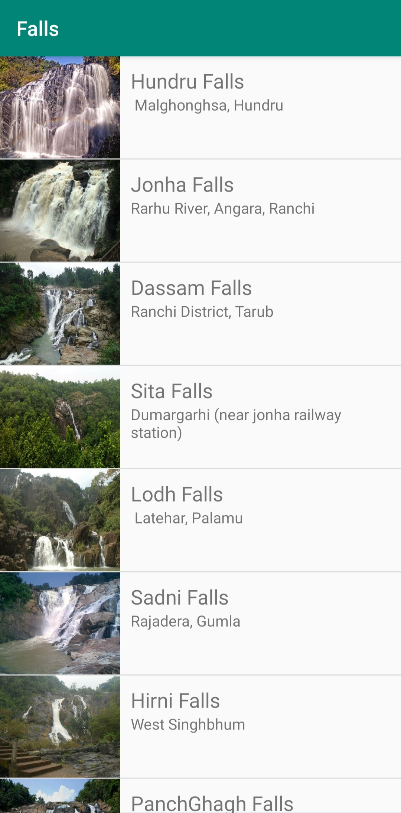
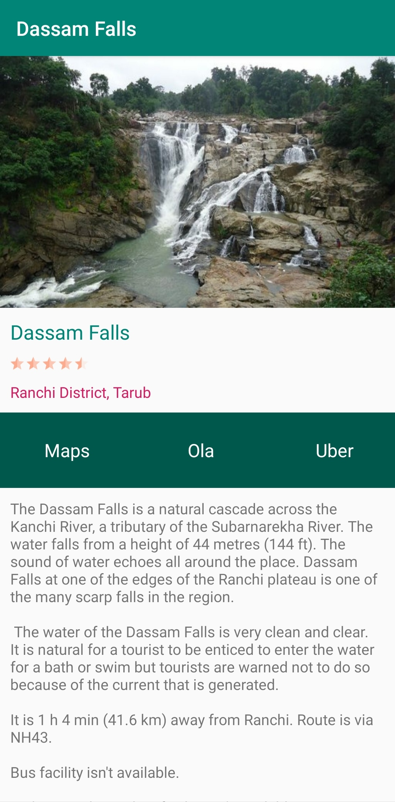

# An android application containing necessary information about the tourist spots of Jharkhand, India.

# Screenshots

Welcome

Categories

List of tourist spots within the selected category

Ratings, location and other information of the selected spot

